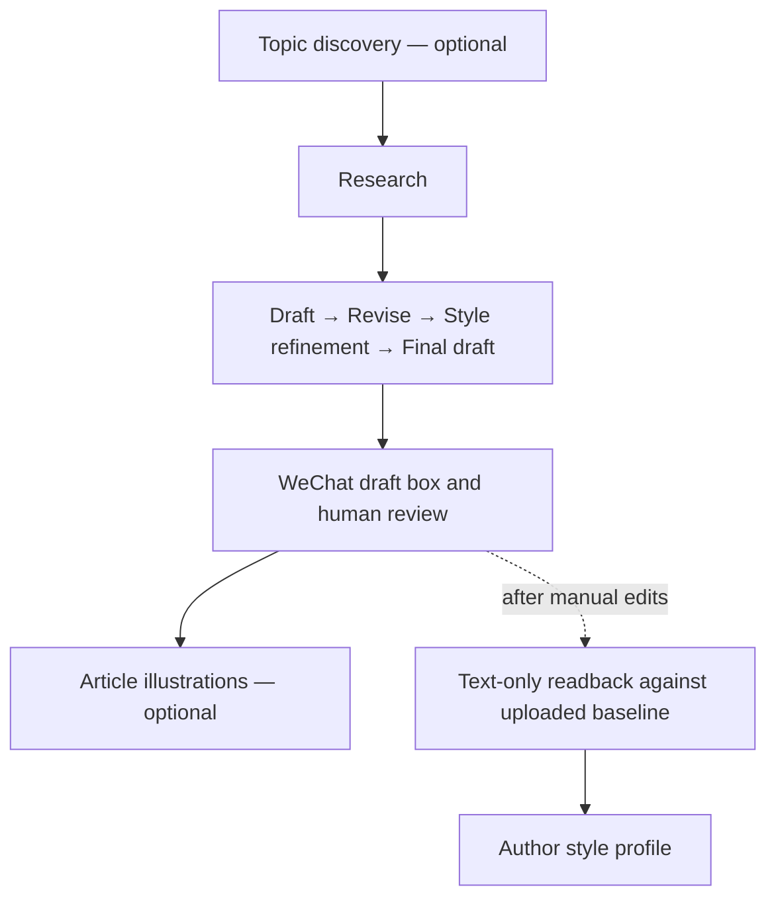

**English** | [简体中文](README.zh-CN.md)

# Content OS

> Turn AI-assisted writing from a one-off generation into a local-first, reviewable, and reusable content production pipeline.

[](LICENSE)


Content OS is an agent-driven workflow for Chinese-language content creators. It connects topic discovery, research, long-form WeChat writing, human calibration, and optional WeChat article illustrations through explicit stages, artifacts, and review gates.

It is not a black box that takes a topic and publishes automatically. Every important stage leaves a local artifact. Research, voice, and external actions are handled separately, and publishing or paid generation always remains an explicit decision.

## Why Content OS

Many AI writing failures are workflow failures rather than model failures: trend signals get mixed with evidence, drafts overwrite one another, author voice is reduced to a single prompt, human edits never become reusable knowledge, and publishing lacks a clear safety boundary.

Content OS turns those problems into executable constraints:

- **Traceable stage artifacts:** every step, from `00_选题卡.md` to `05_最终稿.md` and WeChat draft preparation, has a stable input and output.
- **Research stays separate from expression:** aggregated summaries are signals, not evidence; important claims return to primary sources.
- **Author voice can compound:** representative writing, a style profile, and human feedback calibrate the workflow over time.
- **Human edits improve voice:** readback compares uploaded and edited text for wording, punctuation, and sentence or paragraph rhythm; visual formatting stays outside the style profile.
- **External actions have gates:** draft uploads, remote updates, and paid image generation require explicit confirmation.
- **Sensitive data stays local by default:** working files, credentials, brand references, and private writing samples do not enter Git.

## Workflow



Xiaohongshu adaptation and image production are retired; their instructions are retained in `docs/archive/` and excluded from active routing. Xiaohongshu remains a topic-discovery source. Readback is a style-feedback branch, independent of publishing and illustration.

You do not need to run every optional stage. Trend collection and in-article illustrations are explicit choices, while the core writing stages advance through Review Gates instead of running unattended from start to finish.

## Who It Is For

- WeChat and knowledge-content creators who want AI assistance without flattening their voice.
- Small teams that want stable collaboration points across discovery, research, writing, editing, and publishing.
- Codex and coding-agent users who prefer workflows and artifacts to remain visible inside the repository.
- Creators who care about sources, rollback, and accountable human judgment.

## Quick Start

### 1. Clone and verify

```powershell
git clone https://github.com/chenzhiyong1994/content-os.git
Set-Location content-os
npm ci
npm test
```

Node.js 22.18+ and PowerShell 7+ are required. `npm ci` installs the locked HTML parser used for text readback; tests use the Node.js built-in test runner. Dry runs and previews are isolated per article.

### 2. Add your own style material

1. Put two to five representative pieces you genuinely like in `docs/references/style-examples/`.
2. Complete `docs/references/style-profile.md` with rules supported by those samples or by stable feedback.
3. To keep a consistent cover character, place a reference image at `assets/brand/reference.png`.
4. For a curated source list, copy `source-watchlist.example.md` to the local `source-watchlist.md` and fill it in.

Private samples and brand material are ignored by default or represented by sanitized templates. See the README in each corresponding directory for details.

### 3. Start from your Agent

Open the repository in Codex and ask, for example:

```text
Use the content-workflow to help me create a practical article from topic discovery.
The target audience is everyday office workers.
```

The Agent reads `AGENTS.md`, the workflow rules, and the relevant skill before stopping at each required Review Gate. The canonical stage definitions live in `docs/operations/workflow-rules.md`.

### 4. Configure external capabilities only when needed

| Capability | When it is needed | Default boundary |
| --- | --- | --- |
| External writing engine (optional) | Delegate heavy writing stages to another CLI | Configure the command and model explicitly; otherwise the current Agent writes |
| Browser access | Validate discussions on signed-in social platforms | Run source health checks first; public search cannot impersonate signed-in scanning |
| ImageGen | Covers and WeChat article illustrations | Show the tool path, visible model information, dimensions, output path, and complete prompt before confirmation |
| WeChat Official Account API | Upload and read back drafts | Supply credentials only through environment variables; dry run is supported |

See `.env.example` and `docs/operations/wechat-publish-setup.md` for environment variables. Credentials are never written to logs or the repository.

## Project Structure

```text
.
├─ AGENTS.md                         # Project constitution and task routing
├─ docs/
│  ├─ operations/                    # Workflow, feedback, publishing, and version safety
│  ├─ archive/                       # Retired instructions, excluded from active routing
│  └─ references/                    # Content type, facts, style, and platform standards
├─ skills/                           # Executable instructions for each content stage
├─ scripts/                          # Local helper scripts
├─ tests/                            # Publishing and browser contract tests
├─ assets/brand/                     # Your local brand reference material
└─ workspace/                        # Temporary files and article outputs, ignored by default
```

## Design Principles

1. **Evidence before expression:** trend signals, research evidence, and author judgment carry different weights.
2. **Save before review:** every stable stage is written to disk before human review.
3. **Few hard rules, concrete examples:** style comes from real writing and feedback, not an ever-growing blacklist.
4. **Optional still means explicit:** optional stages are deliberately chosen, never silently skipped or triggered.
5. **Local is the source of truth:** external platforms distribute and calibrate; they do not replace traceable local source material.

## Security and Privacy

- `workspace/`, `.env*`, private writing samples, and brand reference images are ignored by default.
- WeChat credentials are read only from environment variables such as `WECHAT_MP_APP_ID` and `WECHAT_MP_APP_SECRET`.
- Public repository content consists of sanitized templates rather than real credentials, historical articles, author profiles, or brand originals.
- Author names, curated source lists, AI aggregation endpoints, and external writing engines have no maintainer-specific defaults.
- Before publishing your own derivative repository, scan both the current files and Git history. Deleting a file does not remove it from history.

Report security issues through GitHub private vulnerability reporting as described in [SECURITY.md](SECURITY.md). Do not paste credentials or private material into a public Issue.

## Contributing

Contributions that make the workflow more reliable, explainable, or portable are welcome, including:

- New platform adapters and verifiable publishing workflows
- Narrower, more reliable fact checks and regression tests
- Style calibration methods that do not depend on one specific author
- Better Windows, macOS, and Linux compatibility

Read [CONTRIBUTING.md](CONTRIBUTING.md) before submitting a change. If you are trying the project for the first time, opening an Issue about friction encountered on a real topic is equally valuable.

## License

[MIT](LICENSE) © Content OS contributors
