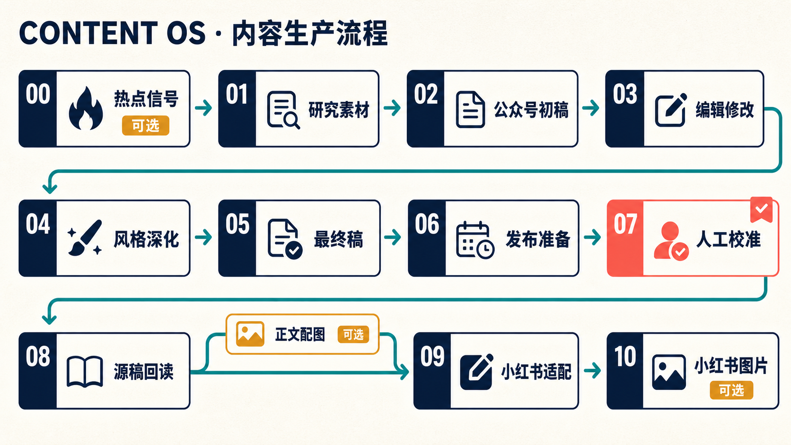

[English](README.md) | **简体中文**

# Content OS

> 把 AI 写作从“一次性生成”，变成一条本地优先、可审查、可复用的内容生产线。

[](LICENSE)


Content OS 面向中文内容创作者，把选题发现、资料研究、微信公众号长文、人工校准、小红书改编和图片准备组织成一套有明确阶段、产物和确认点的工作流。

它不是“输入主题，自动发布”的黑盒。每个关键节点都会留下本地产物；事实、风格和外部动作分开处理；真正发布或付费生成之前，必须由人确认。

## 为什么做这个项目

很多 AI 写作流程的问题不在模型能力，而在流程：热点和证据混在一起、初稿之后不断覆盖、作者声音只靠一句 prompt、一次人工修改没有沉淀、外部发布没有安全边界。

Content OS 尝试把这些问题变成可执行的工程约束：

- **阶段产物可追溯**：从 `00_选题卡.md` 到 `06_小红书版.md`，每一步都有稳定输入和输出。
- **研究与表达分离**：聚合摘要只做信号，不冒充事实来源；关键结论回到原始材料核验。
- **作者声音可积累**：用你自己的代表作、风格画像和人工反馈校准写作，而不是永久依赖一条“像某某那样写”。
- **平台适配不是压缩**：公众号和小红书分别重组材料，不把长文机械切片。
- **外部动作有闸门**：上传草稿、更新远端内容和付费生图之前都要明确确认。
- **敏感数据默认留在本地**：工作产物、凭证、品牌参考图和私人样文默认不进入 Git。

## 工作流



流程不是一定要全部跑完。热点收集、公众号正文配图和图片生成都是明确的可选节点；内容阶段则通过 Review Gate 逐步确认，避免一次性跑到底。

## 适合谁

- 已经在写公众号、小红书或知识型内容，希望 AI 不再把声音磨平的人。
- 想把选题、研究、写作、审稿和发布拆成稳定协作节点的小团队。
- 在使用 Codex 或其他 coding agent，希望规则和产物都留在仓库里的人。
- 重视来源、可回滚性和人工最终判断，不接受“自动化等于无人负责”的创作者。

## 快速开始

### 1. 克隆并验证

```powershell
git clone https://github.com/chenzhiyong1994/content-os.git
Set-Location content-os
npm test
```

仓库没有运行时 npm 依赖；测试使用 Node.js 内置测试运行器。推荐 Node.js 20+ 与 PowerShell 7+。

### 2. 放入你自己的风格材料

1. 把 2–5 篇你真正认可的代表作放进 `docs/references/style-examples/`。
2. 按 `docs/references/style-profile.md` 填写作者声音；只写有样文或稳定反馈支持的规则。
3. 如需统一封面角色，把参考图放到 `assets/brand/reference.png`。
4. 如需定向信源观察列表，把 `source-watchlist.example.md` 复制为本地 `source-watchlist.md` 后填写。

这些文件默认被忽略或提供为脱敏模板，避免私人语料和品牌素材被误提交。详细说明见对应目录里的 README。

### 3. 在 Agent 中启动

用 Codex 打开仓库后，可以直接说：

```text
按 content-workflow 帮我从选题开始做一篇实用文，目标受众是普通上班族。
```

Agent 会先读取 `AGENTS.md`、流程规则和对应 skill，然后停在每个必要的 Review Gate。完整阶段定义以 `docs/operations/workflow-rules.md` 为准。

### 4. 按需配置外部能力

| 能力 | 什么时候需要 | 默认边界 |
| --- | --- | --- |
| 外部写作引擎（可选） | 希望把重写作节点交给其他 CLI 时 | 显式配置命令与模型；未配置时由当前 Agent 执行 |
| 浏览器能力 | 登录态社交讨论验证 | 先做信源健康检查，不用公开搜索冒充登录态扫描 |
| ImageGen | 封面、正文图、小红书图片 | 展示模型、尺寸、输出路径和完整 prompt 后再确认 |
| 微信公众号 API | 上传和回读草稿 | 凭证仅通过环境变量提供，支持 dry run |

环境变量清单见 `.env.example` 和 `docs/operations/wechat-publish-setup.md`。项目不会把凭证写进日志或仓库。

## 项目结构

```text
.
├─ AGENTS.md                         # 项目宪法与任务路由
├─ docs/
│  ├─ operations/                    # 流程、反馈闭环、发布与版本安全
│  └─ references/                    # 内容类型、事实、风格与平台标准
├─ skills/                           # 每个内容节点的可执行说明
├─ scripts/                          # 本地辅助脚本
├─ tests/                            # 发布与浏览器契约测试
├─ assets/brand/                     # 你的本地品牌参考素材
└─ workspace/                        # 临时文件和文章产物（默认不提交）
```

## 设计原则

1. **先证据，后表达**：热点信号、研究证据和作者判断有不同权重。
2. **先保存，再评审**：每个稳定节点先落盘，再进入人工确认。
3. **规则少而硬，语料具体**：风格依赖真实样文和反馈，不靠堆叠禁词。
4. **可选节点也要显式选择**：不静默跳过，也不擅自触发付费或发布动作。
5. **本地是事实源**：外部平台只承担分发和人工校准，不替代可追溯的本地源稿。

## 安全与隐私

- `workspace/`、`.env*`、私人样文和品牌参考图默认在 `.gitignore` 中。
- 微信凭证只读取 `WECHAT_MP_APP_ID`、`WECHAT_MP_APP_SECRET` 等环境变量。
- 仓库自带的公开内容是脱敏模板，不包含真实账号凭证、历史文章、作者画像或品牌原图。
- 作者名、定向信源列表、AI 聚合服务地址和外部写作引擎均无维护者默认值，需要使用者自行配置。
- 准备公开自己的派生仓库前，仍建议扫描当前文件与 Git 历史；删除文件并不会自动从历史中消失。

安全问题请按 [SECURITY.md](SECURITY.md) 使用 GitHub 私密漏洞报告，不要在公开 Issue 中粘贴密钥或个人素材。

## 参与贡献

欢迎提交能让流程更可靠、更可解释或更易迁移的改进，例如：

- 新的平台适配器与可验证发布流程
- 更窄、更可靠的事实检查或回归测试
- 不依赖特定作者的风格校准方法
- 对 Windows / macOS / Linux 更友好的脚本

提交前请阅读 [CONTRIBUTING.md](CONTRIBUTING.md)。如果你只是想试用，也欢迎从一个真实选题开始，把不顺手的地方记录成 Issue。

## License

[MIT](LICENSE) © Content OS contributors
